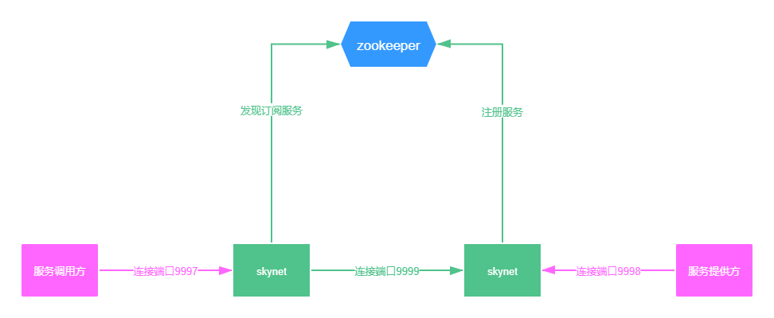

# skynet
skynet 是一个轻量级的rpc调用中间件，类似于service mesh
sidecar，主要目的是降低跨语言rpc调用的复杂程度。
本项目功能与dubbo类似，不过编译后不是一个sdk，而是一个可以运行的程序，服务注册发现的功能主要由本项目实现，从而降低sdk的复杂程度，实现跨语言服务调用。
不管是服务提供方，还是服务调用方都需要连接到skynet，由它进行服务注册发现，消息转发，负载均衡等。服务调用的网络开销，也从传统rpc的一次变成了3次。
后面也会实现unix domain socket来为sdk提供服务，降低调用的网络开销。
本项目使用C++开发，并且使用了C++17新特性。目前实现了消息转发,zookeeper服务注册发现功能，后续陆续实现监控等功能。
目前[Java的sdk](https://github.com/zhwaaaaaa/skynet-java "skynet-java")也在开发中。

## 原理和架构
本项目编译之后生成一个可执行文件skynet。
程序启动需要配置zookeeper地址，启动之后连接到zookeeper，同时默认监听3个端口：9997
9998 9999。
如果是服务提供方，可以连接到端口`9998`。通过握手协议告诉skynet，自己提供的一组服务名称，skynet解析到服务名称之后，会向zookeeper注册服务名和自己的ip地址与9999的端口号。
同时服务提供方需要保持长连接，等待接受服务调用消息。
如果是服务调用方，可以连接到端口`9997`。通过握手协议告诉skynet，自己需要调用的一组服务名称。
skynet解析到服务名称之后会向zookeeper查找和订阅服务名下所有的ip地址和端口号，然后skynet会依次连接到提供该服务的其它skynet。
服务提供方握手成功之后需要保持长连接并且可以使用该连接发送服务调用消息。

后续会使用`unix domain socket`来替代`9997`和`9998`端口，降低网络开销。

## 一些设计
本项目使用libuv库，并且设计了引用计数和缓存的ioBuf，实现数据转发零拷贝，消息转发链路的调用几乎不会在堆上有任何的内存分配，从而拥有超高性能，几乎超越所有rpc框架。

## 性能
使用[Java sdk](https://github.com/zhwaaaaaa/skynet-java "skynet-java")性能测试。
java调用java 100w次用时20秒。qps 5W左右。单次调用延时约为0.8ms (机器配置比较老。同样使用这台机器qps是高于brpc和dubbo的）

## build
目前暂时只测试过ubuntu编译 
### 安装依赖
`apt install cmake libgoogle-glog-dev libuv1-dev libgflags-dev libzookeeper-mt-dev libboost-all-dev`

### 可选依赖
 `apt install libtcmalloc-minimal4`

### 编译
`mkdir build && cd build && cmake .. && make skynet`

### 运行
`./skynet`
